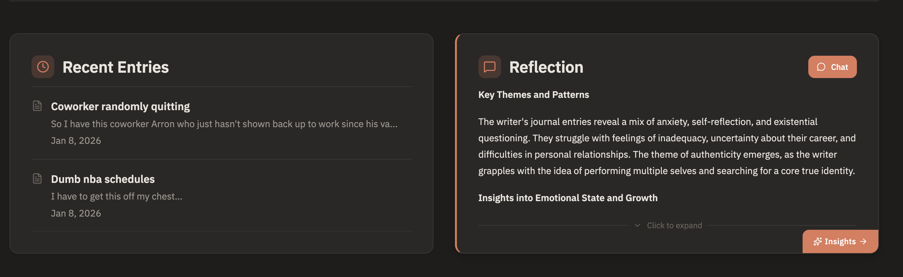
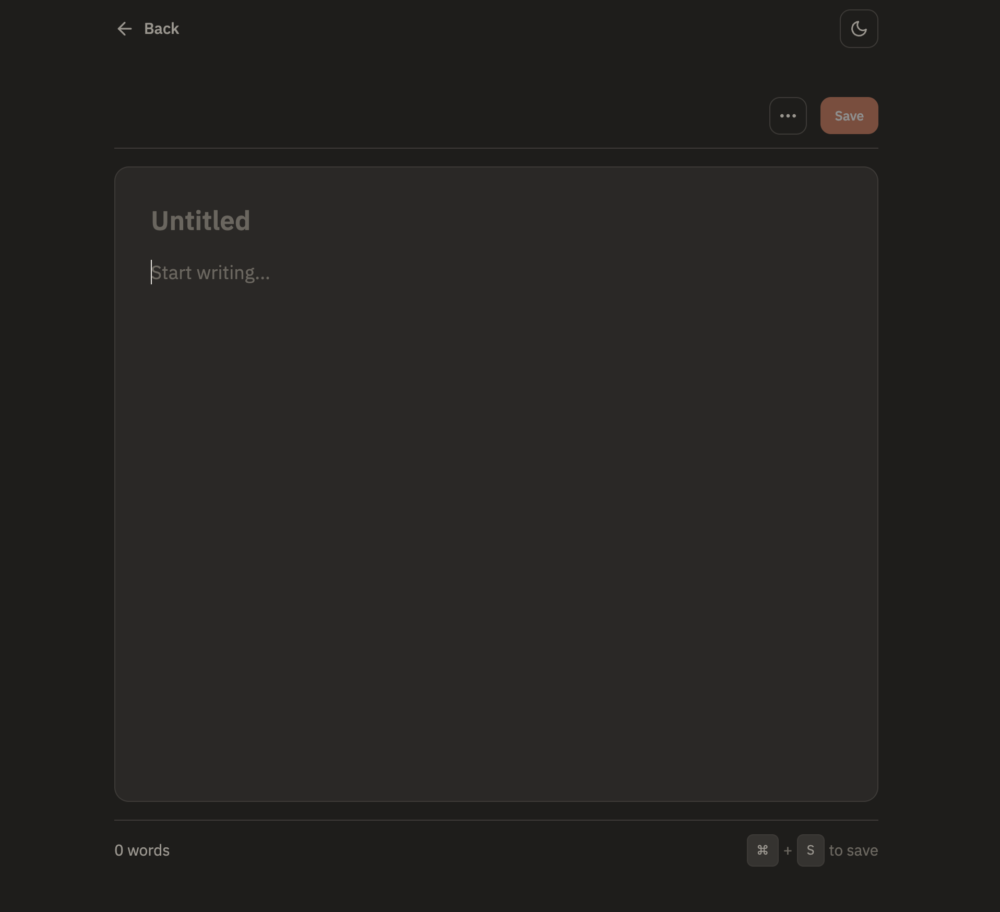
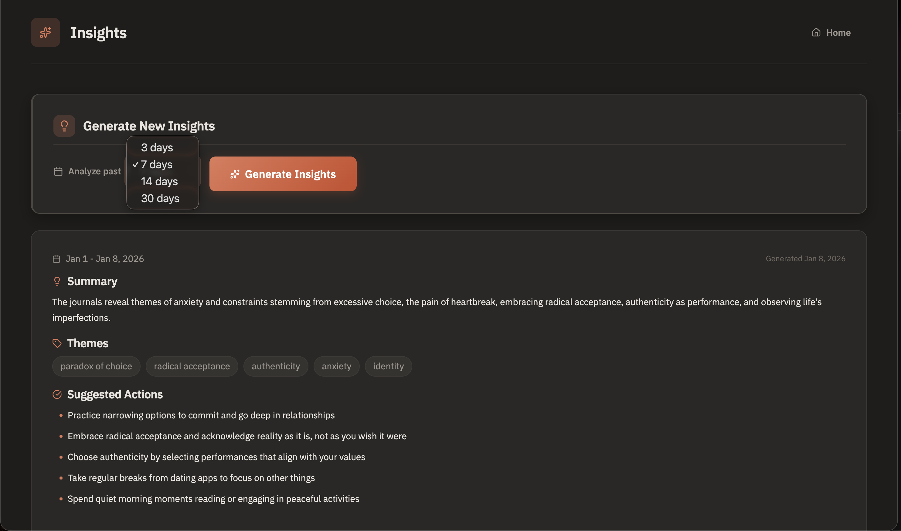

# EchoVault

**A self-hosted AI memory system that learns, recalls, and forgets.**

A privacy-first journaling application with local LLM inference, vector search, and intelligent insights. All processing can happen locally - no data leaves your machine.

---

## Features

### AI & Intelligence

| Feature | Description |
|---------|-------------|
| **Local LLM Processing** | All AI features powered by Ollama running on your machine. Embeddings, reflections, mood inference, and insights - all processed locally for complete privacy. |
| **Custom LLM Support** | Bring your own LLM or use any OpenAI API-compatible provider (OpenAI, Groq, Together.ai, LM Studio, vLLM). Configure generation and embedding models separately with optional API tokens. |
| **Interactive Chat** | Real-time WebSocket-based chat with your reflection assistant. Ask follow-up questions about your entries and receive streaming responses with context from semantically related entries. |
| **Streaming Reflections** | Watch AI-generated reflections appear token-by-token. The assistant analyzes your entries and provides insights about themes, emotional patterns, and actionable suggestions. |
| **Mood Inference** | Automatic mood detection (1-5 scale) from entry content. Set your mood manually or let the AI infer it from your writing. |
| **Automated Insights** | Nightly generation of summaries, themes, and actionable recommendations based on your recent journal entries. |

### Search & Discovery

| Feature | Description |
|---------|-------------|
| **Semantic Search** | Find entries by meaning, not just keywords. Search for "feeling anxious about deadlines" and discover entries about "work stress" or "pressure at the office" - even if those exact words were not used. |
| **Time-Decayed Scoring** | Balance relevance with recency. Recent entries that match your query rank higher, with configurable half-life settings to control the decay rate. |
| **Vector Embeddings** | Every entry is converted to a high-dimensional vector (via mxbai-embed-large or your chosen model) enabling semantic similarity matching across your entire journal. |

### User Experience

| Feature | Description |
|---------|-------------|
| **Neo-Brutalist Design** | Bold, distinctive UI with strong borders, high contrast, and intentional rawness. A fresh take on journaling interfaces. |
| **Dark Mode Support** | Full light/dark/system theme support with smooth transitions. Toggle between themes or follow your system preference. |
| **Distraction-Free Editor** | Minimal writing interface with inline title, collapsible toolbar, word count, and keyboard shortcuts (Cmd/Ctrl+S to save). AI mood detection toggle built in. |
| **Mood Insights Dashboard** | Visual analytics showing mood trends over 7/30/90 days, weekly comparisons, writing streaks, best days, and AI-generated semantic insights about emotional patterns. |
| **Tag Organization** | Add and manage tags for each entry. Quick tag input with keyboard support for efficient categorization. |

### Privacy & Security

| Feature | Description |
|---------|-------------|
| **Privacy-First Architecture** | Your journal data never leaves your machine when using local Ollama. No third-party API calls unless you explicitly configure a cloud LLM provider. |
| **Soft Delete** | Remove entries from search results and active views while keeping the underlying data recoverable. |
| **Hard Delete** | Permanently remove entries and all associated data (embeddings, metadata) with no recovery possible. |
| **JWT Authentication** | Secure token-based authentication with configurable expiration. All API endpoints protected. |

### Deployment Options

| Feature | Description |
|---------|-------------|
| **Docker Compose** | Single-command deployment with all services (API, frontend, database, Redis, Ollama) orchestrated and configured. |
| **Vercel Deployment** | Deploy the Next.js frontend to Vercel with the backend on Railway, Render, or Fly.io. Full deployment guide included. |
| **Flexible Database** | PostgreSQL 16 with pgvector extension. Use local Docker or managed services like Neon or Supabase. |

### Background Processing

| Feature | Description |
|---------|-------------|
| **Celery Task Queue** | Asynchronous processing for embeddings, mood inference, and insights generation. Non-blocking entry creation. |
| **Scheduled Jobs** | Celery Beat scheduler for nightly insight generation and other periodic tasks. |
| **Redis Broker** | Fast, reliable message passing between the API and background workers. |

---

## Screenshots

### Dashboard with Reflections
View your recent entries alongside AI-generated reflections that analyze themes and emotional patterns.



### Distraction-Free Editor
Clean writing interface with dark mode, word count, and keyboard shortcuts.



### AI Insights
Generate AI summaries of your entries with themes, patterns, and actionable suggestions.



### Interactive Chat
Ask follow-up questions about your journal entries and reflections.


### Mood Tracking Chart
Visualize your mood trends over 7, 30, or 90 days with an emoji-based scale.


### Mood Insights
AI-generated analysis of your mood patterns and correlations with writing topics.


---

## How It Works: Understanding the AI Features

If you are new to LLMs (Large Language Models) and vector search, here is what these features actually do for you:

### LLM Processing (Local AI)

**What it is**: An LLM is like having a smart assistant that reads and understands your journal entries. Unlike ChatGPT or other online services, this runs entirely on your computer - your private thoughts never leave your machine.

**What it does for you**:

1. **Reflections**: After you write entries, the AI reads them and provides thoughtful insights. For example, if you wrote about work stress, it might notice patterns like "You have mentioned feeling overwhelmed on Mondays" and suggest actionable advice.

2. **Mood Inference**: The AI automatically detects the emotional tone of your entries (on a scale of 1-5) even if you forget to set it manually. This helps track your mood over time.

3. **Insights Generation**: Every night, the AI analyzes your recent entries and creates summaries like:
   - "This week you focused on work-life balance"
   - "Common themes: stress, family time, gratitude"
   - "Consider taking breaks during work hours"

**Why it is useful**: Instead of manually reviewing hundreds of entries, the AI helps you see patterns, themes, and insights you might miss, but remembering everything you have written.

### Vector Search (Semantic Search)

**What it is**: Traditional search finds entries by matching exact words. Vector search understands the *meaning* behind your words, even if you use different phrasing.

**How it works**:
- When you write an entry, the AI converts it into a "vector" (a mathematical representation of meaning)
- When you search, your query is also converted to a vector
- The system finds entries with similar meanings, not just matching words

**Example**:
- You search for: "feeling anxious about deadlines"
- It finds entries about: "work stress", "pressure at the office", "worried about projects" - even if those exact words were not used
- It also prioritizes recent entries (time-decayed scoring), so newer relevant entries appear first

**Why it is useful**: You can find entries by describing how you felt or what you were thinking about, without remembering the exact words you used. It is like Google Search, but for your personal thoughts.

### Time-Decayed Scoring

**What it is**: A way to balance relevance with recency in search results.

**How it works**:
- Entries that match your search are ranked by both:
  1. How similar they are to your query (semantic similarity)
  2. How recent they are (time decay)
- You can adjust the "half-life" setting: lower values favor recent entries, higher values treat all entries equally regardless of age

**Example**: If you search for "work stress" and have 10 relevant entries:
- A very recent entry about work stress might rank #1 even if it is slightly less similar
- An older entry needs to be much more relevant to rank high
- You control this balance in Settings

**Why it is useful**: Sometimes you want to find what you wrote recently about a topic, not necessarily the most detailed entry from months ago.

---

## Quick Start

### Prerequisites

- Docker and Docker Compose
- Ollama installed locally (or use the Docker service)

### Setup

1. **Clone the repository**
   ```bash
   git clone <repo-url>
   cd echo-vault
   ```

2. **Set up environment variables**

   Copy the example environment file and customize:
   ```bash
   cp default.env .env
   ```

   Edit `.env` and set:
   - `JWT_SECRET`: Generate a strong secret (e.g., `openssl rand -hex 32`)
   - `DEFAULT_GENERATION_MODEL`: Model for reflections/insights (default: `llama3.1:8b`)
   - `DEFAULT_EMBEDDING_MODEL`: Model for embeddings (default: `mxbai-embed-large`)
   - `DEFAULT_GENERATION_URL`: LLM API URL (default: `http://ollama:11434` for Docker)

   See `docs/ENV_CONFIG.md` for all available options.

3. **Pull Ollama models** (before starting services)
   ```bash
   ollama pull llama3.1:8b
   ollama pull mxbai-embed-large
   ```

4. **Start all services**
   ```bash
   cd infra
   docker compose up -d
   ```

5. **Run database migrations**
   ```bash
   docker compose exec api alembic upgrade head
   ```

6. **Access the application**
   - Frontend: http://localhost:3000
   - API: http://localhost:8000
   - API Docs: http://localhost:8000/docs

### First Use

1. Register a new account at http://localhost:3000/register
2. Create your first journal entry
3. Wait a few seconds for embeddings to process
4. Try semantic search to find related entries
5. Check insights page for AI-generated summaries

---

## Architecture

See [ARCHITECTURE.md](docs/ARCHITECTURE.md) for detailed system design.

### Services

| Service | Port | Purpose |
|---------|------|---------|
| web | 3000 | Next.js frontend |
| api | 8000 | FastAPI backend |
| worker | - | Celery background jobs |
| beat | - | Celery scheduler |
| db | 5432 | PostgreSQL 16 + pgvector |
| redis | 6379 | Celery broker |
| ollama | 11434 | Local LLM inference |

---

## API Documentation

See [API.md](docs/API.md) for complete API reference.

Interactive documentation available at http://localhost:8000/docs when the API is running.

---

## Development

### Backend Development

```bash
cd api
pip install -r requirements.txt
uvicorn main:app --reload
```

### Frontend Development

```bash
cd app
pnpm install
pnpm run dev
```

### Running Tests

**Backend:**
```bash
cd api
pytest
```

**Frontend E2E:**
```bash
cd app
pnpm exec playwright test
```

---

## Deployment

### Vercel + Cloud Backend

For production deployment with Vercel (frontend) and Railway/Render/Fly.io (backend), see the comprehensive guide: [DEPLOYMENT_VERCEL.md](docs/DEPLOYMENT_VERCEL.md)

The guide covers:
- Database setup (Neon or Supabase with pgvector)
- Redis setup (Upstash or Railway)
- Backend deployment options
- Ollama considerations for cloud deployment
- Environment variable reference
- Security checklist

---

## Desktop App

EchoVault is also available as a desktop application for macOS, Windows, and Linux.

### Prerequisites

- **Docker Desktop** must be installed and running
- Backend services running via Docker Compose

### Installation

1. **Download the installer** from the [Releases](https://github.com/your-username/echovault/releases) page:
   - macOS: `.dmg` file
   - Windows: `.msi` or `.exe` installer
   - Linux: `.AppImage` or `.deb` package

2. **Start backend services** (if not already running):
   ```bash
   cd infra
   docker compose up -d
   ```

3. **Launch EchoVault** - The app will check for backend connectivity on startup

### Features

- **System Tray**: Minimize to tray, quick access to new entry
- **Global Shortcut**: `Cmd/Ctrl + Shift + E` to quickly open a new entry
- **Auto-Updates**: Receive updates automatically when new versions are released
- **Native Notifications**: Reminders and alerts via system notifications

### Development

To run the desktop app in development mode:

```bash
cd app
pnpm install
pnpm tauri:dev
```

To build installers:

```bash
cd app
pnpm tauri:build
```

**Note**: Building requires Rust toolchain. See [Tauri Prerequisites](https://v2.tauri.app/start/prerequisites/).

---

## Docker Image Versions

All Docker images are pinned to specific versions for reproducibility:

| Service | Image | Version |
|---------|-------|---------|
| Ollama | `ollama/ollama` | sha256 pinned |
| Redis | `redis` | 7.2.5-alpine |
| PostgreSQL | `pgvector/pgvector` | pg16 |
| Node.js | `node` | 20.18.0-alpine |
| Python | `python` | 3.11.10-slim |

---

## Configuration

### LLM Settings

Users can configure their own LLM endpoints in Settings:

| Setting | Description | Example |
|---------|-------------|---------|
| Generation URL | LLM API endpoint for text generation | `http://localhost:11434` or `https://api.openai.com/v1` |
| Generation Model | Model name for reflections/insights | `llama3.1:8b` or `gpt-4o` |
| Embedding URL | API endpoint for embeddings | `http://localhost:11434` |
| Embedding Model | Model for vector embeddings | `mxbai-embed-large` or `text-embedding-3-small` |
| API Token | Optional Bearer token for authentication | Required for OpenAI, Groq, etc. |

### Search Decay

Adjust the search half-life in Settings to control how quickly older entries decay in search results. Lower values favor recent entries.

### Privacy Settings

- **Soft Delete**: Removes entries from search but keeps content
- **Hard Delete**: Permanently deletes entries and all associated data

---

## Troubleshooting

### Ollama Connection Issues

Ensure Ollama is running and accessible:
```bash
curl http://localhost:11434/api/tags
```

### Database Connection

Check database is healthy:
```bash
docker compose ps
```

### Background Jobs Not Running

Check Celery worker logs:
```bash
docker compose logs worker
```

### Embeddings Not Generating

1. Verify Ollama has the embedding model:
   ```bash
   ollama list
   ```
2. Check worker logs for errors
3. Ensure user has valid LLM settings configured

---

## License

MIT
