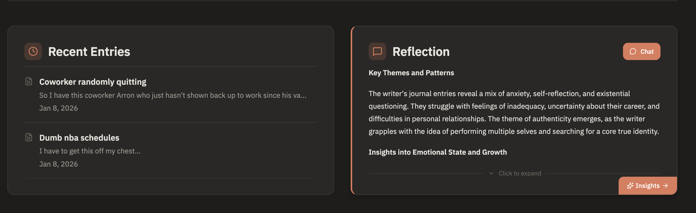
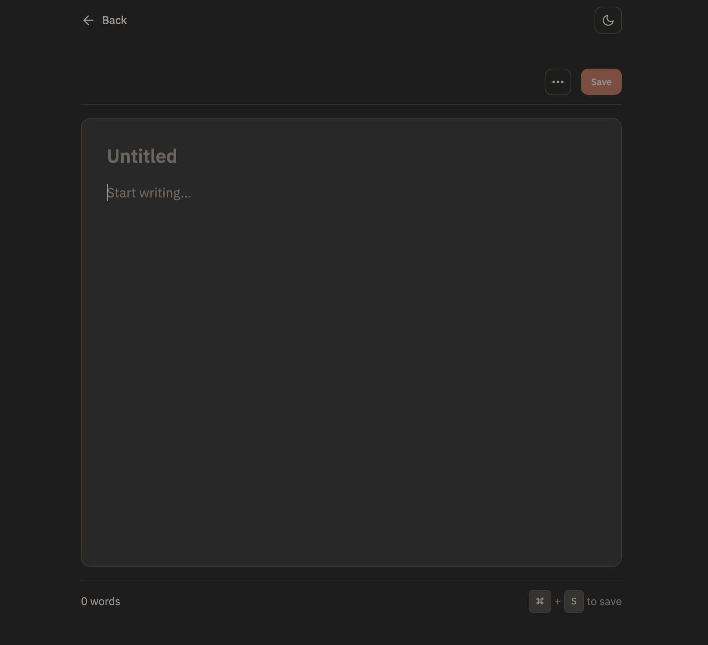
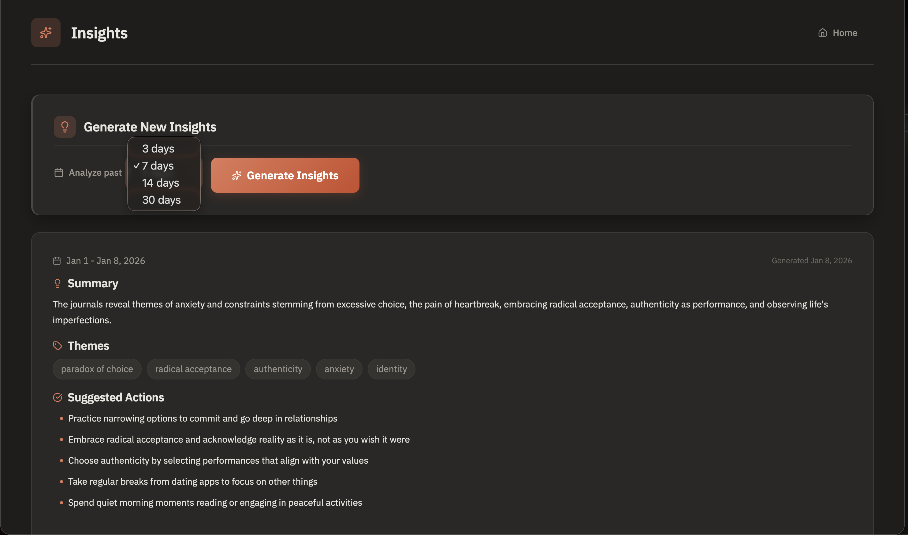
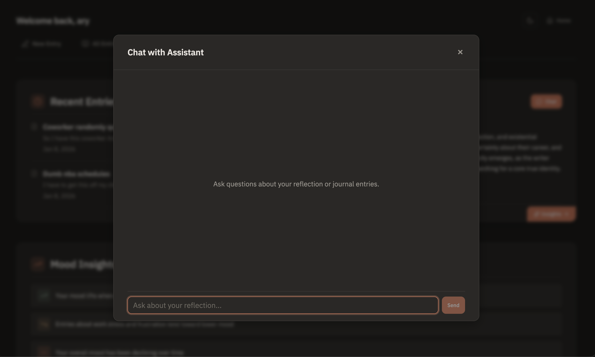
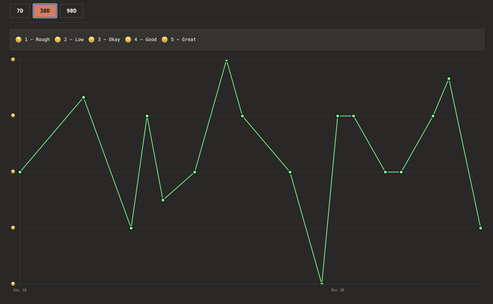
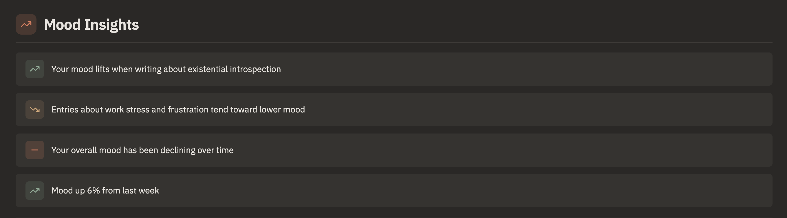

# EchoVault

**A self-hosted AI journal that learns from what you write — and forgets when you ask it to.**

EchoVault is a private journaling app. You write entries; an AI on your own machine reads them, finds patterns, and helps you reflect on them. The catch most other journaling apps have — that your words get sent off to someone else's server — does not apply here. By default, nothing leaves your laptop.

This README is the front door. If you have never set up a project like this before, do not worry: every step is covered, and every piece of jargon is explained the first time it appears.

---

## Who this is for

- **You journal and want better recall.** Search by what you meant, not the exact words you typed.
- **You care about privacy.** You would rather your therapist's notes app not phone home to OpenAI.
- **You want to learn how a modern full-stack app is built.** This is a working example with a Next.js frontend, a FastAPI backend, a vector database, a job queue, and a local LLM — all wired together.

If any of those words are new, read the [Glossary](#glossary) at the bottom first.

---

## What it does

### Things you can do as a user

- **Write journal entries** in a clean editor. Tag them, set a mood, or let the AI guess the mood for you.
- **Search by meaning.** Type "feeling stuck at work" and find old entries that talk about being demotivated, even if you never used those exact words.
- **Get AI reflections** — short, generated summaries that surface themes across your recent writing.
- **Chat with your journal** in a streaming conversation, where the AI pulls in relevant past entries as context.
- **Track mood trends** over 7, 30, or 90 days.
- **Forget things.** Soft delete hides an entry from search; hard delete erases it permanently.

### Things that happen behind the scenes

- Every entry is converted into a **vector embedding** — a list of 1024 numbers that represents the entry's meaning. Search works by comparing embeddings.
- A background worker handles the slow stuff (embedding, mood inference, reflections) so the UI never freezes.
- A local LLM (Ollama) runs on your machine and does all the AI work by default. You can swap it out for OpenAI, Groq, or any OpenAI-compatible API in Settings.

---

## Screenshots

### Dashboard with reflections


### Distraction-free editor


### AI insights


### Chat with your journal


### Mood tracking


### Mood insights


---

## Quick start

This is the five-minute version. For a step-by-step guide written for someone who has never used Docker before, read [SETUP.md](SETUP.md).

### Prerequisites

- **Docker Desktop** (Mac/Windows) or Docker Engine + Docker Compose (Linux). Docker is the tool that runs all the services in isolated containers — see the [Glossary](#glossary).
- **Ollama**, installed locally. This is the program that runs the AI model on your computer. Get it from [ollama.com](https://ollama.com).

### Steps

```bash
# 1. Clone the repo
git clone <repo-url>
cd echo-vault

# 2. Create your config file from the template
cp default.env .env
# Then edit .env and set JWT_SECRET to a random string.
# You can generate one with: openssl rand -hex 32

# 3. Pull the AI models (this downloads several GB, takes a few minutes)
ollama pull llama3.1:8b
ollama pull mxbai-embed-large

# 4. Start everything
cd infra
docker compose up -d

# 5. Open the app
open http://localhost:3000
```

If something goes wrong, jump to [Troubleshooting](#troubleshooting) or the more detailed [SETUP.md](SETUP.md).

---

## How the AI features actually work

If "vector search" and "LLM" are buzzwords to you, here is what they really mean inside this app.

### The LLM (Large Language Model)

An LLM is a program that reads text and writes text back. EchoVault uses one for three things:

1. **Reflections** — after you write a few entries, the LLM reads them and produces a short note like "you've mentioned feeling overwhelmed three times this week — consider a smaller to-do list tomorrow."
2. **Mood inference** — if you don't manually pick a mood (1-5), the LLM reads your entry and guesses one.
3. **Insights** — a longer analysis covering 3, 7, 14, or 30 days of entries.

By default, the LLM is **Ollama** running on your own machine. Your text never leaves your computer. You can switch to OpenAI, Groq, or any compatible service in Settings if you prefer.

### Vector embeddings and semantic search

Traditional search ("Ctrl-F") matches exact words. **Semantic search** matches meaning.

Here is the trick: a separate AI model (called an embedding model) converts each journal entry into a list of 1024 numbers. Entries about similar topics end up with similar lists of numbers, even when the words are completely different. When you search, your query also gets turned into 1024 numbers, and the database finds entries whose numbers are closest.

So you can search "feeling stuck at work" and get back an old entry titled "Why is everything boring lately?" because, mathematically, those two are talking about the same thing.

### Time-decayed scoring

Pure semantic similarity has a problem: a perfectly-matching entry from two years ago will outrank a slightly-less-matching one from yesterday — but you probably wanted yesterday's. EchoVault fixes this by multiplying the similarity score by a **decay factor** based on age:

```
score = similarity * (1 / (1 + age_in_days / half_life_days))
```

The half-life is set in Settings (default: 30 days). Lower it to favor recent entries; raise it to treat all entries equally regardless of age.

---

## Why this stack? (Plain-English version)

| Choice | Why it's here |
|---|---|
| **Docker** | Lets you run six different services (database, web app, API, job queue, etc.) without installing six different programs on your machine. Each service runs in a sealed box that talks to the others over a private network. |
| **Next.js + React** | Next.js is the framework for the web frontend. We picked it because it has good defaults for server-side rendering, routing, and deployment to Vercel. React is the UI library it's built on. |
| **FastAPI (Python)** | The backend API server. FastAPI is fast, easy to write, and gives you free interactive API docs at `/docs`. Python was the natural choice because most LLM tooling is Python-first. |
| **PostgreSQL + pgvector** | PostgreSQL is the database that stores your account, entries, and tags. The `pgvector` extension is what lets the same database also store and search vector embeddings, so we don't need a separate vector database. |
| **Redis** | A fast in-memory store. We use it for two things: passing job messages to the background worker, and caching reflections so they load instantly on a return visit. |
| **Celery** | A background-job runner. Embedding an entry takes 1-2 seconds, which is too slow to make the user wait. Celery picks up that work in the background while the UI stays snappy. |
| **Ollama** | Runs the LLM on your machine. The privacy story falls apart if we have to send your journal to OpenAI for every reflection — Ollama is what makes local-first possible. |

---

## Documentation

| Doc | What's in it |
|---|---|
| [SETUP.md](SETUP.md) | Step-by-step install for first-timers. Read this if `docker compose up -d` made you nervous. |
| [docs/ARCHITECTURE.md](docs/ARCHITECTURE.md) | How the pieces fit together, with diagrams of the main data flows. |
| [docs/ENV_CONFIG.md](docs/ENV_CONFIG.md) | Every environment variable, what it does, and what to set it to. |
| [docs/FEATURES.md](docs/FEATURES.md) | Full feature reference, written from the user's perspective. |
| [docs/API.md](docs/API.md) | HTTP endpoint reference. The interactive version lives at http://localhost:8000/docs once the API is running. |
| [docs/DEPLOYMENT_VERCEL.md](docs/DEPLOYMENT_VERCEL.md) | How to deploy to production (Vercel + Railway/Render/Fly.io). |
| [docs/WEBSOCKET_AUTH_GUIDE.md](docs/WEBSOCKET_AUTH_GUIDE.md) | How real-time chat is authenticated. |
| [docs/architecture/async-celery-pattern.md](docs/architecture/async-celery-pattern.md) | A design note on why Celery tasks call async code with `asyncio.run()`. |

---

## Services overview

When `docker compose up -d` finishes, six containers are running:

| Service | Port | What it does |
|---|---|---|
| `web` | 3000 | The Next.js frontend you open in the browser. |
| `api` | 8000 | The FastAPI backend that handles all data and auth. |
| `worker` | — | A Celery process that runs background jobs. |
| `db` | 5432 | PostgreSQL with pgvector — stores everything. |
| `redis` | 6379 | The job queue and reflection cache. |
| `ollama` | 11434 | The local LLM. |

You don't usually need to think about them individually — `docker compose` starts them all in the right order.

---

## Local development (without Docker)

If you want to run the frontend or backend directly on your machine — handy when you're editing code and want hot-reload — you still need the database, Redis, and Ollama running somewhere (Docker is the easy way).

**Backend:**
```bash
cd api
pip install -r requirements.txt
uvicorn main:app --reload
```

**Frontend:**
```bash
cd app
pnpm install
pnpm run dev
```

**Run tests:**
```bash
cd api && pytest                          # backend
cd app && pnpm exec playwright test       # frontend end-to-end
```

---

## Desktop app

EchoVault also ships as a native desktop app via Tauri.

**Prerequisites:** Docker Desktop must be running (the desktop app is just a wrapper around the same backend).

**Install:** download the installer for your OS from the Releases page (`.dmg` for macOS, `.msi` for Windows, `.AppImage`/`.deb` for Linux).

**Build from source:**
```bash
cd app
pnpm install
pnpm tauri:dev      # run in dev mode
pnpm tauri:build    # build installers (requires Rust toolchain)
```

Building installers requires Rust. See [Tauri prerequisites](https://v2.tauri.app/start/prerequisites/).

**Desktop-only features:**
- System tray with quick "new entry" shortcut
- Global hotkey: `Cmd/Ctrl + Shift + E`
- Native OS notifications

---

## Configuration cheat sheet

You configure EchoVault in two places:

1. **`.env` file in the project root** — used by Docker Compose for the whole stack. Set things like `JWT_SECRET`, `DATABASE_URL`, and the default LLM endpoints here.
2. **The Settings page in the app** — per-user overrides. Each user can point at a different LLM, change the search half-life, or enable hard delete.

Common Settings-page options:

| Setting | What it does |
|---|---|
| Generation URL / Model | Where to send chat/reflection prompts. Use `http://localhost:11434` for local Ollama, or `https://api.openai.com/v1` for OpenAI. |
| Embedding URL / Model | Where to generate vector embeddings. Often the same as Generation. |
| API Token | Bearer token, only needed for cloud providers like OpenAI/Groq. |
| Search half-life | How quickly older entries decay in search results. Default 30 days. |
| Hard delete | Off by default. When on, "forget" permanently deletes entries instead of soft-hiding them. |

For the full list of environment variables, see [docs/ENV_CONFIG.md](docs/ENV_CONFIG.md).

---

## Troubleshooting

### Ollama is not responding

```bash
curl http://localhost:11434/api/tags
```

You should see a JSON list of models. If not, start Ollama and re-run `ollama pull llama3.1:8b mxbai-embed-large`.

### "Service is not healthy" on startup

```bash
docker compose ps          # see which container failed
docker compose logs <name> # read its logs
```

The most common causes are: Ollama not finished starting, the `.env` file missing a value, or port 3000/5432/6379/8000/11434 already in use by something else.

### Embeddings or reflections never appear

```bash
docker compose logs worker
```

The worker handles all the AI jobs. If it's quietly erroring (usually because Ollama is unreachable or a model isn't pulled), you'll see it here.

### Database connection errors

```bash
docker compose ps db
docker compose logs db
```

Check that `DATABASE_URL` in `.env` matches the credentials in the `db` service.

For a deeper guide, see the Troubleshooting section in [SETUP.md](SETUP.md).

---

## Glossary

Quick definitions for the terms used throughout the docs:

- **API** — Application Programming Interface. The set of HTTP endpoints the frontend calls to read or write data.
- **Container** — a sealed environment that holds one program plus everything it needs to run. Started and stopped by Docker.
- **Docker** — software that runs containers on your machine.
- **Docker Compose** — a tool that starts a group of containers together with one command (`docker compose up`).
- **Database** — long-term storage. EchoVault uses PostgreSQL.
- **Environment variable** — a `KEY=value` pair the app reads at startup. Stored in the `.env` file.
- **JWT** — JSON Web Token. A signed string the app uses to remember you're logged in.
- **LLM** — Large Language Model. The AI that reads and writes text. EchoVault uses Ollama by default.
- **Ollama** — a small program that runs LLMs on your machine. Listens on port 11434.
- **pgvector** — a PostgreSQL extension that adds a "vector" column type so you can do semantic search inside the database.
- **Port** — a number that identifies a network service on your machine. The frontend lives on port 3000, the API on 8000, and so on.
- **Vector embedding** — a list of numbers that represents the meaning of a piece of text. Similar meanings produce similar numbers.
- **WebSocket** — a long-lived two-way connection between the browser and the server, used here for streaming chat responses token-by-token.

---

## License

MIT
